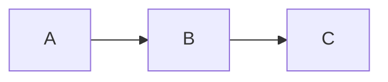
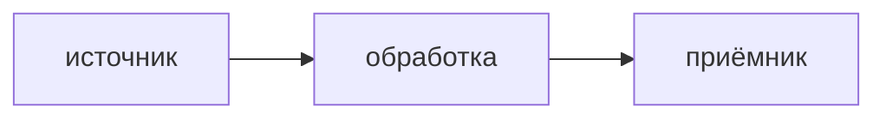

# Архитектура

> Это скелет-плейсхолдер. Заполни секции под свою систему. Структура секций
> намеренно такая, чтобы её можно было читать и людям, и агентам.

## Что это

<!-- Одно-два предложения: что это за система, какую роль играет. -->

## Что делает

<!-- Нумерованный список ключевых функций. -->

1. **<Глагол>** — кратко что делает и зачем.

## Чего не делает

<!-- Явные границы: что NOT in scope. Важно для агентов, чтобы не «помогали»
     там, где не надо. -->

- Не делает …

## Слои

<!-- Перечень слоёв/модулей с однострочной ролью каждого. -->

```
<модуль-A>   роль
<модуль-B>   роль
<модуль-C>   роль
```

Зависимости (DAG):



## Потоки данных

<!-- Главные потоки системы. Mermaid-схемы приветствуются. -->



### <Поток 1: имя>

<!-- Шаги потока с объяснением. -->

## Доверительная граница

<!-- Где проходит граница доверия, что по какую сторону, какие гарантии.
     Для систем без границ доверия — секцию можно убрать. -->

- …

## Ссылки

<!-- Внешние документы, хаб, ADR. -->

- `docs/adr/` — архитектурные решения.