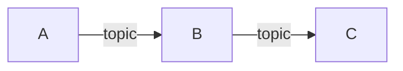
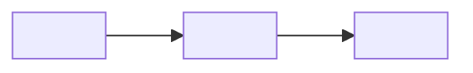

# Архитектура

> Скелет системы микросервисов в одном монорепо. Стек per-сервис —
> `docs/STACKS.md`, раскладка — `docs/LAYOUT.md`, деплой — `docs/DEPLOYMENT.md`.
> Заполни секции под свою систему. Структура секций намеренно читается и людьми,
> и агентами.

## Что это

<!-- 1–2 предложения: что за система, какую роль играет. -->

## Что делает

<!-- Нумерованный список ключевых функций на уровне системы. -->

1. **<Глагол>** — кратко что делает и зачем.

## Чего не делает

<!-- Явные границы системы. -->

- Не делает …

## Сервисы

<!-- Таблица сервисов монорепо. Каждый — каталог services/<name>/ со своим
     стеком (один язык на сервис) и Dockerfile. -->

| Сервис | Стек | Роль | Публикует / Читает (топики) |
|---|---|---|---|
| `<service-a>` | Rust | … | publish: `…` / consume: `…` |
| `<service-b>` | Python | … | … |
| `<service-c>` | Go | … | … |

Зависимости между сервисами (через брокер):

## Брокер

<!-- Один брокер на систему (Kafka / Redpanda / NATS — зафиксируй). Сервисы
     общаются ТОЛЬКО через него. -->

- **Брокер:** <Kafka | Redpanda | NATS>
- **Адрес (local):** из `docker-compose.yml`, сервис `broker`.

Топики:

| Топик | Кто публикует | Кто читает | Назначение |
|---|---|---|---|
| `<topic>` | `<service>` | `<service>` | … |

Формат сообщений (event envelope) — см. `docs/CONVENTIONS.md` (или хаб).

## Потоки данных

<!-- Главные потоки системы через брокер. Mermaid приветствуется. -->

### <Поток 1: имя>

<!-- Шаги потока с объяснением. -->

## Доверительная граница

<!-- Где проходит граница доверия, что по какую сторону, какие гарантии.
     Для систем без границ доверия — секцию можно убрать. -->

- …

## Деплой

- Локальная разработка и деплой — `docker-compose.yml` (детали — `docs/DEPLOYMENT.md`).
- Каждый сервис — отдельный контейнер со своим `Dockerfile`.
- Брокер и общая инфраструктура — сервисы в корневом compose.
- Сеть compose изолирует сервисы; внешние порты открываются осознанно.

## Ссылки

- `docs/adr/` — архитектурные решения.
- Внешний хаб (если есть) — состав, ADR, конвенции.